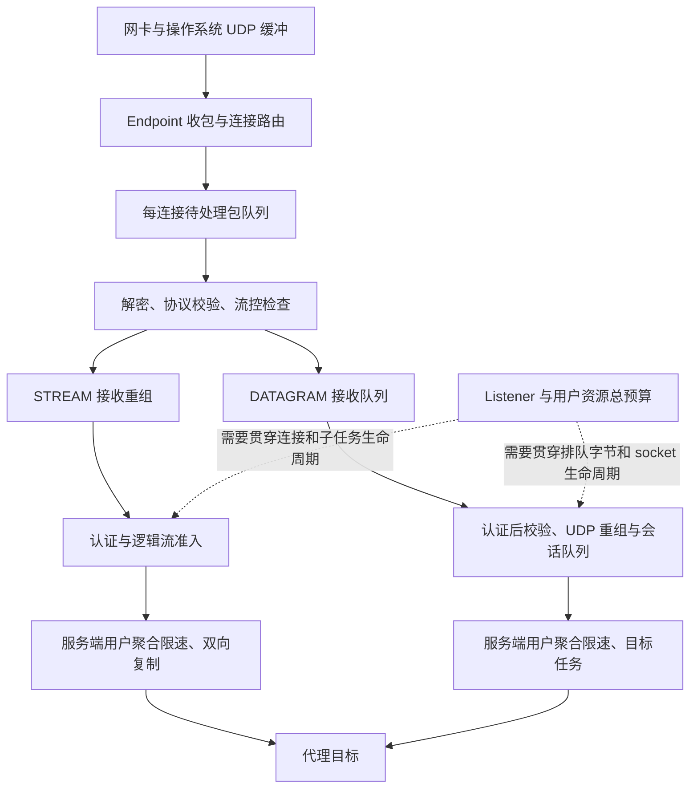

# HY2 核心资源控制与成熟实现对标

审计日期：2026-09-03。基线为 node-agent-rs `35f9d3c`、shoes-plus `e4bff6f`，以及下列参考报告中固定的 Go 版本。本次先核对完整资源路径，再用本地测试验证具体问题；不能将本次发现全部归因于此前线上上传故障。

## 结论

客户端即使收到 `auto` 或带宽上限，仍可以自行决定发送方式。服务端拥塞控制只控制自己的发送；应用层上传限速控制的是交付给代理目标的数据，不会免除此前的网卡收包、QUIC 路由、解密和帧解析成本。因此配置协商正确并不等于节点已经具备资源隔离。

当前实现已有实际背压、握手准入、接收窗口、逻辑流与 UDP 队列限制，但很多额度只覆盖一条物理 QUIC 连接。认证后的连接可以继续累积，跨连接的内存、任务和目标 socket 没有统一的 listener 预算。这是本次对“异常客户端是否会影响整个节点”的主要回答：**可能影响；目前不能宣称已经完成整体隔离。**

成熟实现值得对标的是每个限制放置的位置、持有时间、满额后的处理与调度方式。固定版本的 sing-box/quic-go 和 Xray 也有未设置总额度的路径；不能把它们当成已经提供无限负载保证的模板。

完整证据分为两份附件：

- [sing-box、sing-quic、quic-go、Xray 与本机 Go node-agent 对照源码](hy2-reference-controls.md)：版本、官方代码链接、参数分支和逐阶段控制。
- [当前 Rust HY2 应用层控制](hy2-application-controls.md)：准入、TCP/UDP 生命周期、资源持有、取消以及未完成验证的边界。

后续用户反馈 2 GB 上传成功，但 Speedtest 下载切换上传仍可能断网；对应的 [ACK 调度、BBR 与官方 Go 互通复盘](hysteria2-speedtest-transition.md)记录了追加修复与验证。

## 1. 必须分别约束的资源路径



`STREAM` 的接收窗口控制未交付字节；`DATAGRAM` 不使用 STREAM 流控，排队满额通常需要丢弃。每秒字节数、每秒包数、并发连接数、任务数、缓冲区字节数和实际保留分配是不同指标。一个指标有上限，不能推出其余指标有上限。[QUIC 流控](https://www.rfc-editor.org/rfc/rfc9000.html#section-4)、[资源攻击考量](https://www.rfc-editor.org/rfc/rfc9000.html#section-21.9)

## 2. 对标结果

| 控制面 | 成熟源码的真实行为 | 当前 Rust 状态与差距 |
| --- | --- | --- |
| 协商与服务端执法 | sing-quic 的 `auto`/数字带宽决定拥塞协商；本机 Go node-agent 的用户桶是另外一层 | 已有独立用户桶，多连接共用；`ignore_client_bandwidth` 不是资源防线 |
| 未分配报文与控制响应 | quic-go listener 收包队列 1024，Retry/拒绝等队列另有小容量上限 | Quinn 的未接收 Incoming 默认最多 65536，单项缓冲 10 MiB、endpoint 总缓冲 100 MiB；HY2 后续有 Retry 和 1024/每来源 64 的握手门。不同阶段额度需要统一核算 |
| 已知连接待处理包 | quic-go 每连接 256，满额丢包；每轮处理至多 32 包 | 上次已补每连接 256 项入口预算；局部关闭/重绑定事件保留。它不限制多连接总量，也不消除路由/解密工作 |
| 调度公平性 | quic-go 分批处理；Xray/sing 双向复制独立运行，下游写入会形成背压 | Quinn 有调度预算；本轮确认并修复代理复制循环预算消耗位置错误，以及固定方向优先问题 |
| 接收流控与重组 | quic-go 检查连接/流窗口、真正的空洞数量；超出协议额度关闭该连接 | 保留 HY2 的 8/20 MiB 窗口和上次重组修复；违反传输流控不会被当作合法不限速数据接收 |
| DATAGRAM 内存 | quic-go 收队列最多 128 项；Xray UDP Hub 256 项，满时释放丢弃 | Quinn 默认收预算 1,250,000 字节、发送预算 1 MiB。本轮修复计数和底层分配保留问题；它们仍是单连接预算 |
| 应用缓冲与目标 | Xray 管道达到阈值后等待；sing-quic 有关联队列，但默认关联表未设数量额度 | 已有 TCP 1024 流、UDP 512 会话/1024 目标、16 MiB 队列/8 MiB 分片等单连接上限；跨连接总额度缺失 |
| 认证后多连接 | 参考项目也未处处提供 listener 或进程级总额度，Go 默认值不能直接视为硬防护 | 用户 `max_conns=0` 为不限，认证即释放握手槽，不能阻止资源随连接数增长 |
| 取消与释放 | Xray interrupt/close 唤醒管道；sing 双向复制按错误结束并关闭双方 | 已有连接取消树、流/会话/目标 Drop 取消；UDP 目标独立建立/写入期限及 target 级 idle 仍需完善 |
| 可观测性 | 日志与统计帮助判断连接失败，不能替代资源控制 | 上次已加 HY2 异常关闭日志；还需要按作用域记录队列占用/丢弃、活跃目标、准入拒绝和调度延迟 |

Quinn 细节依据：`vendor/quinn-proto/src/config/mod.rs:251–253`、`config/transport.rs:386–389`、`connection/streams/state.rs` 的流控/流并发校验，以及 `vendor/quinn/src/endpoint.rs`、`connection_events.rs`。

调度方面，Quinn `RECV_TIME_BOUND=50µs` 是 WorkLimiter 的目标值，不是硬时限；其工作量每 256 轮重新采样，`endpoint.rs` 按 socket message 计数，一个 GRO message 中仍可能包含多个报文。`connection.rs` 使用 Tokio 通道的协作预算，不能与 quic-go 的固定 32 包批次视为相同实现。这里没有把预算差异直接断言为已经复现的全节点阻塞。

## 3. 本轮已经复现并修正的问题

### 3.1 复制循环没有正确消耗调度预算

旧 `CopyBuffer::poll_copy` 只在整个 poll 入口取得一次 Tokio coop guard。在内部反复调用 `made_progress()` 不会反复扣减预算。持续返回 Ready 的缓冲流可能在一个 poll 中完成全部工作；原有注释声称会周期让出，但代码未做到。

本轮在每次 read/write/ping/flush 前取得预算，Pending 时按 Tokio 规则退回；双向转发在后续 poll 中轮换先后，避免上传每轮先花完预算而反向数据一直得不到机会。四个确定性用例在旧代码全部失败，修复后全部通过，覆盖整批、小步读取、小步写入和上传期间反向响应，并验证恢复后字节一致。

这证明了通用复制器的公平性缺陷。正常 TCP socket 自身通常会协作调度，因此不能把此测试写成对此前 WAN 故障原因的再次确认。

### 3.2 DATAGRAM 发送预算计数错误

`DatagramBuffer::pop_front()` 已减去 payload；旧丢包发送路径再减一次，第三次触发旧包回收后即出现“实际 48 字节、计数 32 字节”。此外等待式发送与空间查询漏计已有队列的 metadata，空 payload 也不能正确占用空间。

本轮统一以队列 payload 和所有已占 entry 的 metadata 计算等待式准入与可用空间，删除重复扣减。保持旧版 drop=true 允许最后一个 datagram 超出窗口的兼容行为，未将它描述为严格 RSS 上限。

### 3.3 DATAGRAM 接收预算与实际保留分配不一致

旧队列保存解码后的 `Bytes` 切片，1 字节数据仍可保留原 UDP/GRO 缓冲。通过带释放计数的本地 buffer owner 验证：入队后原 1472 字节分配仍未释放。队列现在只持有 payload 大小的存储；1472 和 1472×64 两种 backing 的释放用例通过，空数据 metadata 限制和旧包先丢语义也保持。

代价是每个接收 DATAGRAM 增加一次 payload 拷贝，STREAM 路径不增加这次拷贝。预算不包含分配器额外开销和 `VecDeque` 闲置容量；更上层 HY2 对完整应用报文切片的持有仍需单独处理。

## 4. 仍然需要结构性改造的部分

这些差距没有通过添加一个任意 Mbps 常量或降低客户端带宽来掩盖。

| 优先级 | 差距 | 具体改造入口与验收要求 |
| --- | --- | --- |
| P1 | 认证后连接、任务、排队内存可跨连接放大 | 在 HY2 listener 创建共享资源上下文，所有 endpoint 使用同一份；连接/用户/流/目标按生命周期持有配额。认证成功只释放握手配额，不能释放活动连接配额。分别限制用户份额与节点总量，满额立即拒绝或丢弃，不创建无限等待任务 |
| P1 | HY2 分片与转发只计 payload，切片仍可保留地址/完整报文 | 在应用队列的持久化边界归一化所有权或计入完整存储；同时计算 packet entry、fragment slot 和目标地址的 metadata。以释放计数和 TTL/取消后的回落验证，不能仅检查 `payload.len()` |
| P1 | UDP target 建立/write/flush 缺少统一绝对期限 | 对整个建链和一次发送流程设置可取消期限；增加 target 级 idle，避免同 session 中另一个活跃 target 永久保留旧目标。用本地永不完成的 connector 验证到期释放且其他目标继续运行 |
| P2 | 包/短流创建等操作量不由 Mbps 限速覆盖 | 对创建/解析工作使用可配置操作预算和明确批次边界；保留 ACK、关闭及恢复所需控制路径。以健康账号握手/延迟、队列峰值和 CPU 观测判断，不只测攻击侧吞吐 |
| P2 | 资源不足缺少分类统计 | 记录按 listener/用户/连接作用域的准入拒绝、排队字节/条目、丢弃原因、存活任务和最长调度延迟，提供断开后资源归零的验收依据 |

配额需要与机器容量和预期并发匹配，并与用户商业限速分开：用户 Mbps=0 或 max_conns=0 的含义，不应自动变成整个进程可以无限分配资源。新的容量配置及默认值属于结构性实现，本轮没有把一个未经容量验证的常量声称为完整方案。

## 5. 已完成验证及边界

- 复制公平性四项单元回归：旧代码四项失败，新代码四项通过。
- DATAGRAM 存储四项回归：旧代码可证发送计数/空间查询及接收 backing 保留错误；新代码四项通过。vendor 的独立锁文件和 CI 步骤保证可重复运行。
- 协商不一致：客户端收到 auto 后强制高 Brutal，两条连接共上传 6 MiB；服务端按同一用户聚合限速，首跑 2.5205 秒，与桶的理论最低 2.5 秒相符；同时原连接下载和另一账号的新握手/请求完成。
- 持续畸形输入：首跑 2 秒内发送 8832 个 DATAGRAM frame，实际合并为 152 个 QUIC packet，另一账号三次新握手/请求在输入期间完成。这是输入处理隔离验证，**不是高 PPS 测试**。
- 重跑此前 128 MiB 上传、停读/丢包乱序和跨协议复制/限速回归：node-agent 五个测试文件共 17 项通过，加上上述 8 项核心单元回归，本轮相关验证共 25 项通过；格式与 Clippy 检查通过。

本轮没有模拟公网链路被占满，也没有把内核队列、NIC、共享出口和无限并发连接的影响排除。实际部署仍需分别观测进程资源、健康账号新连接、现有连接响应和停止负载后的回收；“进程存在”与“其他用户持续可用”是两项不同验收条件。

复现命令：

```sh
# shoes-plus
cargo test --locked --lib copy_bidirectional::tests
cargo test --manifest-path vendor/quinn-proto/Cargo.toml --locked --lib connection::datagrams::tests

# node-agent-rs
cargo test --locked -p shoes-engine --test hysteria2_isolation --test hysteria2_upload --test speed_limits --test tuic --test naiveproxy
```
